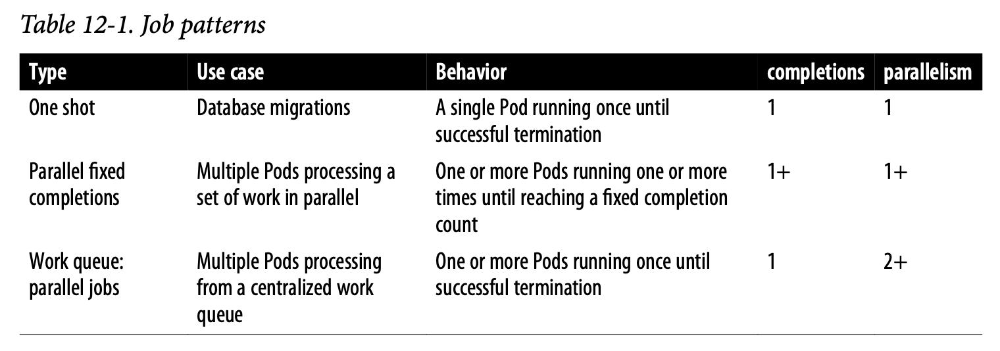

# Chapter 12: Jobs (not yet tested)

The Job object is mainly used to run short-lived, one-off tasks. A job creates Pods that run until successful termination (i.e., exit with 0). In contrast, a regular Pod will continually restart regardless of its exit code.

Jobs are useful for things you only want to do once, such as database migrations or batch jobs.

## Job Patterns

Jobs are designed to manage batch-like workloads where work items are processed by one or more Pods. By default, each job runs a single Pod once until `successful termination`. This job pattern is defined by two primary attributes of a job, namely `the number of job completions` and the `number of Pods to run in parallel`. In the case of the “run once until completion” pattern, the completions and parallelism parameters are set to 1.



### One-shot

One-shot jobs provide a way to run a single Pod once until successful termination.

```yaml
apiVersion: batch/v1 
kind: Job
metadata:
  name: oneshot
spec:
  template: 
    spec:
      containers:
      - name: kuard
        image: gcr.io/kuar-demo/kuard-amd64:blue
        imagePullPolicy: Always
        args:
        - "--keygen-enable"
        - "--keygen-exit-on-complete" 
        - "--keygen-num-to-gen=10"
      restartPolicy: OnFailure
```

`restartPolicy: OnFailure` is the option that tells kubectl to create a Job object. And the `--restart=OnFailure` if we are running it from the CLI.

Then describe the oneshot job and view the logs:

```sh
kubectl describe jobs oneshot

kubectl logs oneshot-4kf3h
```

`Note:`  The Job object will `automatically pick a unique label` and use it to identify the Pods it creates. In advanced scenarios (such as swapping out a running job without killing the Pods it is managing), users can choose to turn off this automatic behavior and manually specify labels and selectors.

Better set the restartPolicy to be `OnFailure`, to not create junk pods, and just restart the pods in place.

## Paralelism

Example of running multiple jobs in parallel

```yaml
apiVersion: batch/v1
kind: Job
metadata:
  name: parallel
  labels:
    chapter: jobs
spec:
  parallelism: 5
  completions: 10
  template:
    metadata:
      labels:
        chapter: jobs 
    spec:
      containers: 
      - name: kuard
        image: gcr.io/kuar-demo/kuard-amd64:blue
        imagePullPolicy: Always
        args:
        - "--keygen-enable"
        - "--keygen-exit-on-complete"
        - "--keygen-num-to-gen=10"
      restartPolicy: OnFailure
```

New Pods are created until 10 have completed altogether. Here we use the `--watch` flag to have kubectl stay around and list changes as they happen

### Worker Queues

### CronJobs

Sometimes you want to schedule a job to be run at a certain interval. To achieve this you can declare a `CronJob` in Kubernetes, which is responsible for creating a new Job object at a particular interval. The declaration of a `CronJob` looks like:

```yaml
apiVersion: batch/v1beta1
    kind: CronJob
    metadata:
      name: example-cron
    spec:
      # Run every fifth hour
      schedule: "0 */5 * * *"
      jobTemplate:
        spec:
          template:
            spec:
              containers:
              - name: batch-job
                image: my-batch-image
              restartPolicy: OnFailure
```