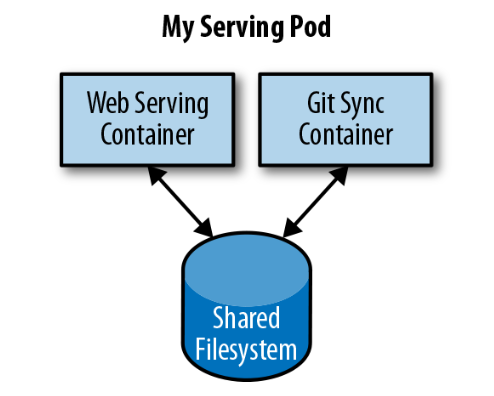

# Chapter 5: Pods

A canonical example of how to containarize an application is illustrated below, which consists of a container serving web requests and a container synchronizing the filesystem with a remote Git repository.



At first, it might seem tempting to wrap up both the web server and the Git synchronizer into a single container. After closer inspection, however, the reasons for the separation become clear. First, the two different containers have significantly different requirements in terms of resource usage. Take, for example, memory. Because the web server is serving user requests, we want to ensure that it is always available and responsive. On the other hand, the Git synchronizer isn’t really user-facing and has a “best effort” quality of service.

Suppose that our Git synchronizer has a memory leak. We need to ensure that the Git synchronizer cannot use up memory that we want to use for our web server, since this can affect web server performance or even crash the server.

This sort of resource isolation is exactly the sort of thing that containers are designed to accomplish. By separating the two applications into two separate containers, we can ensure reliable web server operation.
Of course, the two containers are quite symbiotic; it makes no sense to schedule the web server on one machine and the Git synchronizer on another. Consequently, Kubernetes groups multiple containers into a single atomic unit called a Pod.

## Pods in Kubernetes

A Pod represents a collection of application containers and volumes running in the same execution environment. Pods, not containers, are the smallest deployable artifact in a Kubernetes cluster. This means all of the containers in a Pod always land on the same machine.

Each container within a Pod runs in its own cgroup, but they share a number of Linux namespaces.

`Important:` Applications running in the same Pod share the same IP address and port space (net‐ work namespace), have the same hostname (UTS namespace), and can communicate using native interprocess communication channels over System V IPC or POSIX message queues (IPC namespace). However, applications in different Pods are iso‐ lated from each other; they have different IP addresses, different hostnames, and more. Containers in different Pods running on the same node might as well be on different servers.

## Thinking with Pods

Sometimes people see Pods and think, “Aha! A WordPress container and a MySQL database container should be in the same Pod.” However, this kind of Pod is actually an example of an `anti-pattern` for Pod construction. 

There are two reasons for this. First, WordPress and its database are not truly symbiotic. If the WordPress container and the database container land on different machines, they still can work together quite effectively, since they communicate over a network connection. Secondly, you don’t necessarily want to scale WordPress and the database as a unit. WordPress itself is mostly stateless, and thus you may want to scale your WordPress frontends in response to frontend load by creating more WordPress Pods. Scaling a MySQL data‐ base is much trickier, and you would be much more likely to increase the resources dedicated to a single MySQL Pod. If you group the WordPress and MySQL containers together in a single Pod, you are forced to use the same scaling strategy for both con‐ tainers, which doesn’t fit well.

In general, the right question to ask yourself when designing Pods is, “Will these con‐ tainers work correctly if they land on different machines?” If the answer is “no,” a Pod is the correct grouping for the containers. If the answer is “yes,” multiple Pods is probably the correct solution. In the example at the beginning of this chapter, the two containers interact via a local filesystem. It would be impossible for them to operate correctly if the containers were scheduled on different machines.

## The Pod Manifest

Pods are described in a `Pod manifest`. The Pod manifest is just a text-file representation of the Kubernetes API object. Kubernetes strongly believes in declarative configuration. Declarative configuration means that you write down the desired state of the world in a configuration and then submit that configuration to a service that takes actions to ensure the desired state becomes the actual state.

## Creating a pod

The simplest way to create a Pod is via the imperative kubectl run command. For example, to run our same kuard server, use:

```sh
kubectl run kuard --generator=run-pod/v1 \ --image=gcr.io/kuar-demo/kuard-amd64:blue
```

You can see the status of this Pod by running:

```sh
kubectl get pods
```

You may initially see the container as Pending, but eventually you will see it transition to Running, which means that the Pod and its containers have been successfully created.

For now, you can delete this Pod by running:

```sh
kubectl delete pods/kuard
```

We will now move on to writing a complete Pod manifest by hand.

## Creating a Pod manifest

Pod manifests include a couple of key fields and attributes: namely a metadata section for describing the Pod and its labels, a spec section for describing volumes, and a list of containers that will run in the Pod.

```yaml

```