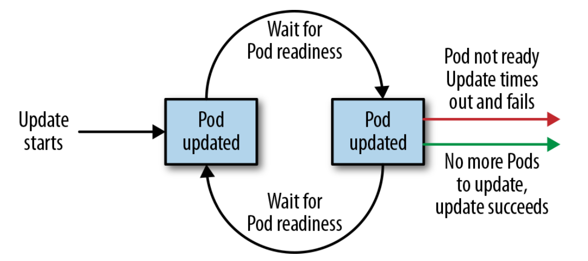

# Chapter 10: Deployments (not yet tested)

The `Deployment` object exists to manage the release of new versions. Deployments represent deployed applications in a way that transcends any particular version.

The actual mechanics of the software rollout performed by a deployment is controlled by a `deployment controller` that runs in the Kubernetes cluster itself. This means you can let a deployment proceed unattended and it will still operate correctly and safely.

## First Deployment

A deployment can be represented as a declarative YAML object that provides the details about what you want to run. In the following case, the deployment is requesting a single instance of the kuard application:

```yaml
apiVersion: extensions/v1beta1
kind: Deployment
metadata:
  name: kuard
spec:
  selector:
    matchLabels:
      run: kuard
  replicas: 1
  template:
    metadata:
      labels:
        run: kuard
    spec:
      containers:
      - name: kuard
        image: gcr.io/kuar-demo/kuard-amd64:blue
```

## Deployment internals

Get the replicaSet

```sh
kubectl get replicasets --selector=run=kuard
```

Modify the replicaSet (only up)

```sh
kubectl scale deployments kuard --replicas=2
```

If you ever want to manage that `ReplicaSet` directly, you need to delete the deployment (remember to set --cascade to false, or else it will delete the ReplicaSet and Pods as well!).

Get detaied info about the deployment

```sh
kubectl describe deployments kuard
```

## Updating Deployments

The two most common operations on a deployment are scaling and application updates. The best practice is to manage your deployments `declaratively` via the YAML files, and then use those files to update your deployment. To scale up a deployment, you would edit your YAML file to increase the number of replicas:

```yaml
spec:
  replicas: 3
```

Once you have saved and committed this change, you can update the deployment using the kubectl apply command:

```sh
kubectl apply -f kuard-deployment.yaml
```

Check then the status of the deployment

```sh
kubectl get deployments kuard
```

### Updating a container image

```yaml
containers:
- image: gcr.io/kuard-demo/kuard-amd64:greeb
  imagePullPolicy: Always
```

We are also going to put an annotation in the template for the deployment to record some information about the update:

```yaml
spec:
  template:
    metadata:
      annotations:
        kubernetes.io/change-cause: "Update to green kuard"
```

After you update the deployment it will trigger a rollout, which you can then monitor via the kubectl rollout command:

```sh
kubectl rollout status deployment kuard
```

You can see the old and new ReplicaSets managed by the deployment along with the images being used. Both the old and new ReplicaSets are kept around in case you want to roll back:

```sh
kubectl get replicasets -o wide
```

You can also pause & resume the rollout

```sh
kubectl rollout pause deployments kuard

kubectl rollout resume deployments kuard
```

### Rollout History

Kubernetes deployments maintain a history of rollouts, which can be useful both for understanding the previous state of the deployment and to roll back to a specific version. You can check it by running the following command:

```sh
kuard rollout history deployment kuard

OUTPUT:
deployment.extensions/kuard
REVISION  CHANGE-CAUSE
1         <none>
2         Update to green kuard
```

More about `change-cause` can be found [here](https://kubernetes.io/docs/concepts/workloads/controllers/deployment/#checking-rollout-history-of-a-deployment)

You can also check individual revisions

```sh
kubectl rollout history deployment kuard --revision=2
```

Rollback to previous version

```sh
kubectl rollout undo deployments kuard

# Or to a specific revision
kubectl rollout undo deployments kuard --to-revision=3
```

## Deployment Strategies

When it comes time to change the version of software implementing your service, a Kubernetes deployment supports two different rollout strategies:

- Recreate
- RollingUpdate

### Recreate Strategy

The `Recreate` strategy is the simpler of the two rollout strategies. It simply updates the `ReplicaSet` it manages to use the new image and terminates all of the Pods associated with the deployment. The `ReplicaSet` notices that it no longer has any replicas, and re-creates all Pods using the new image. Once the Pods are re-created, they are running the new version.

While this strategy is fast and simple, it has one major drawback—it is potentially catastrophic, and will almost certainly result in some site downtime. Because of this, the `Recreate` strategy should only be used for test deployments where a service is not user-facing and a small amount of downtime is acceptable.

### RollingUpdate Strategy

The `RollingUpdate` strategy is the generally preferable strategy for any user-facing service. While it is slower than Recreate, it is also significantly more sophisticated and robust. Using `RollingUpdate`, you can roll out a new version of your service while it is still receiving user traffic, without any downtime.

As you might infer from the name, the `RollingUpdate` strategy works by updating a few Pods at a time, moving incrementally until all of the Pods are running the new version of your software.

### Configuring a rolling update

RollingUpdate is a fairly generic strategy; it can be used to update a variety of appli‐ cations in a variety of settings. Consequently, the rolling update itself is quite configu‐ rable; you can tune its behavior to suit your particular needs. There are two parameters you can use to tune the rolling update behavior: `maxUnavailable` and `maxSurge`.

The `maxUnavailable` parameter sets the maximum number of Pods that can be unavailable during a rolling update. It can either be set to an absolute number (e.g., 3, meaning a maximum of three Pods can be unavailable) or to a percentage (e.g., 20%, meaning a maximum of 20% of the desired number of replicas can be unavailable).

Generally speaking, using a percentage is a good approach for most services, since the value is correctly applicable regardless of the desired number of replicas in the deployment. However, there are times when you may want to use an absolute number (e.g., limiting the maximum unavailable Pods to one).

The `maxSurge` parameter controls how many extra resources can be created to ach‐ ieve a rollout. To illustrate how this works, imagine we have a service with 10 replicas. We set maxUnavailable to 0 and `maxSurge` to 20%. The first thing the rollout will do is scale the new ReplicaSet up to 2 replicas, for a total of 12 (120%) in the service. It will then scale the old ReplicaSet down to 8 replicas, for a total of 10 (8 old, 2 new) in the service. This process proceeds until the rollout is complete. At any time, the capacity of the service is guaranteed to be at least 100% and the maximum extra resources used for the rollout are limited to an additional 20% of all resources.

Setting maxSurge to 100% is equivalent to a `blue/green deployment`. The deployment controller first scales the new version up to 100% of the old version. Once the new version is healthy, it immediately scales the old version down to 0%.

### Slowing Rollouts to Ensure Service Health

The deployment controller always waits until a Pod reports that it is ready before moving on to updating the next Pod.

`Note:` The deployment controller examines the Pod’s status as determined by its `readiness checks`. Readiness checks are part of the Pod’s health probes, and they are described in detail in Chapter 5. If you want to use deployments to reliably roll out your software, you have to specify `readiness health checks` for the containers in your Pod. Without these checks, the deployment controller is `running blind`.

In most real-world scenarios, you want to wait a period of time to have high confidence that the new version is operating correctly before you move on to updating the next Pod.

For deployments, this time to wait is defined by the `minReadySeconds` parameter:

```yaml
spec:
  minReadySeconds: 60
```

To set the timeout period, the deployment parameter `progressDeadlineSeconds` is used:

```yaml
spec:
  progressDeadlineSecounds: 600
```

This example sets the progress deadline to 10 minutes. If any particular stage in the rollout fails to progress in 10 minutes, then the deployment is marked as failed, and all attempts to move the deployment forward are halted.

It is important to note that this timeout is given in terms of deployment progress, not the overall length of a deployment. In this context, progress is defined as any time the deployment creates or deletes a Pod. When that happens, the timeout clock is reset to zero.



## Deleting a Deployment

```sh
kubectl delete deployments kuard

# Or using the declarative YAML file

kubectl delete -f kuard-deployment.yaml
```
