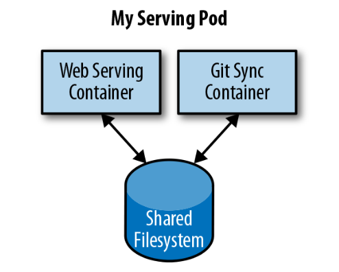

# Chapter 5: Pods

A canonical example of how to containarize an application is illustrated below, which consists of a container serving web requests and a container synchronizing the filesystem with a remote Git repository.



At first, it might seem tempting to wrap up both the web server and the Git synchronizer into a single container. After closer inspection, however, the reasons for the separation become clear. First, the two different containers have significantly different requirements in terms of resource usage. Take, for example, memory. Because the web server is serving user requests, we want to ensure that it is always available and responsive. On the other hand, the Git synchronizer isn’t really user-facing and has a “best effort” quality of service.

Suppose that our Git synchronizer has a memory leak. We need to ensure that the Git synchronizer cannot use up memory that we want to use for our web server, since this can affect web server performance or even crash the server.

This sort of resource isolation is exactly the sort of thing that containers are designed to accomplish. By separating the two applications into two separate containers, we can ensure reliable web server operation.
Of course, the two containers are quite symbiotic; it makes no sense to schedule the web server on one machine and the Git synchronizer on another. Consequently, Kubernetes groups multiple containers into a single atomic unit called a Pod.

## Pods in Kubernetes

A Pod represents a collection of application containers and volumes running in the same execution environment. Pods, not containers, are the smallest deployable artifact in a Kubernetes cluster. This means all of the containers in a Pod always land on the same machine.

Each container within a Pod runs in its own cgroup, but they share a number of Linux namespaces.

`Important:` Applications running in the same Pod share the same IP address and port space (net‐ work namespace), have the same hostname (UTS namespace), and can communicate using native interprocess communication channels over System V IPC or POSIX message queues (IPC namespace). However, applications in different Pods are iso‐ lated from each other; they have different IP addresses, different hostnames, and more. Containers in different Pods running on the same node might as well be on different servers.

## Thinking with Pods

Sometimes people see Pods and think, “Aha! A WordPress container and a MySQL database container should be in the same Pod.” However, this kind of Pod is actually an example of an `anti-pattern` for Pod construction.

There are two reasons for this. First, WordPress and its database are not truly symbiotic. If the WordPress container and the database container land on different machines, they still can work together quite effectively, since they communicate over a network connection. Secondly, you don’t necessarily want to scale WordPress and the database as a unit. WordPress itself is mostly stateless, and thus you may want to scale your WordPress frontends in response to frontend load by creating more WordPress Pods. Scaling a MySQL database is much trickier, and you would be much more likely to increase the resources dedicated to a single MySQL Pod. If you group the WordPress and MySQL containers together in a single Pod, you are forced to use the same scaling strategy for both con‐ tainers, which doesn’t fit well.

In general, the right question to ask yourself when designing Pods is, “Will these containers work correctly if they land on different machines?” If the answer is “no,” a Pod is the correct grouping for the containers. If the answer is “yes,” multiple Pods is probably the correct solution. In the example at the beginning of this chapter, the two containers interact via a local filesystem. It would be impossible for them to operate correctly if the containers were scheduled on different machines.

## The Pod Manifest

Pods are described in a `Pod manifest`. The Pod manifest is just a text-file representation of the Kubernetes API object. Kubernetes strongly believes in declarative configuration. Declarative configuration means that you write down the desired state of the world in a configuration and then submit that configuration to a service that takes actions to ensure the desired state becomes the actual state.

## Creating a pod

The simplest way to create a Pod is via the imperative kubectl run command. For example, to run our same kuard server, use:

```sh
kubectl run kuard --generator=run-pod/v1 \ --image=gcr.io/kuar-demo/kuard-amd64:blue
```

You can see the status of this Pod by running:

```sh
kubectl get pods
```

You may initially see the container as Pending, but eventually you will see it transition to Running, which means that the Pod and its containers have been successfully created.

For now, you can delete this Pod by running:

```sh
kubectl delete pods/kuard
```

We will now move on to writing a complete Pod manifest by hand.

## Creating a Pod manifest

Pod manifests include a couple of key fields and attributes: namely a metadata section for describing the Pod and its labels, a spec section for describing volumes, and a list of containers that will run in the Pod.

```yaml
apiVersion: v1
kind: Pod 
metadata:
  name: kuard
spec:
  containers:
    - image: gcr.io/kuar-demo/kuard-amd64:blue
      name: kuard
      ports:
        - containerPort: 8080
          name: http
          protocol: TCP
```

### Commands to work with

```sh
# Creating the pod
kubectl apply -f kuard-pod.yaml

# Listing the pods
kubectl list (or get pods)

# Find more information about a pod
kubectl describe pods kuard

# Deleting a pod
kubectl delete pods/kuard

# Deleting a pod using the file we used to create it
kubectl delete -f kuard-pod.yaml
```

By default, the kubectl command-line tool tries to be concise in the information it reports, but you can get more information via command-line flags. Adding -o wide to any kubectl command will print out slightly more information (while still trying to keep the information to a single line). Adding -o json or -o yaml will print out the complete objects in JSON or YAML, respectively.

### Deleting a pod

When a Pod is deleted, it is not immediately killed. Instead, if you run kubectl get pods you will see that the Pod is in the `Terminating state`. All Pods have a termination grace period. By default, this is 30 seconds. When a Pod is transitioned to `Terminating` it no longer receives new requests. In a serving scenario, the grace period is important for reliability because it allows the Pod to finish any active requests that it may be in the middle of processing before it is terminated.

It’s important to note that when you delete a Pod, any data stored in the containers associated with that Pod will be deleted as well. If you want to persist data across multiple instances of a Pod, you need to use `PersistentVolumes`, described at the end of this chapter.

## Accessing the Pod

```sh
# Using port forwarding
kubectl port-forward kuard 8080:8080

# Accessing the pod from outside the localhost machine
kubectl port-forward --address '0.0.0.0' pod/kuard 8080:8080

# Getting more information with logs
kubctl logs kuard
# Adding the -f flag will cause you to continuously stream logs.
```

- `--address '0.0.0.0'`: This tells kubectl to bind to all network interfaces, making the port accessible from any IP that can reach your machine.

### Accessing logs

- Adding the `-f` flag will cause you to continuously stream logs.
- Adding the `--previous` flag will get logs from a previous instance of the container. This is useful, for example, if your containers are continuously restarting due to a problem at container startup.

### Running commands in the container

```sh
kubectl exec kuard date

#Gget an interactive session by adding the -it flags
kubectl exec -it  kuard ash
```

The command `kubectl exec -it kuard ash` opens an interactive shell session (ash) inside the container of the pod named "kuard." This is commonly used for debugging or managing files directly inside the container.

### Copying Files to and from Containers

```sh
kubectl cp <pod-name>:/captures/capture3.txt ./capture3.txt

kubectl cp $HOME/config.txt <pod-name>:/config.txt
```

Generally speaking, copying files into a container is an `anti-pattern`. You really should treat the contents of a container as `immutable`. But occasionally it’s the most immedi‐ ate way to stop the bleeding and restore your service to health, since it is quicker than building, pushing, and rolling out a new image. Once the bleeding is stopped, however, it is critically important that you immediately go and do the image build and rollout, or you are guaranteed to forget the local change that you made to your con‐ tainer and overwrite it in the subsequent regularly scheduled rollout.

## Health checks

When you run your application as a container in Kubernetes, it is automatically kept alive for you using a process health check. This health check simply ensures that the main process of your application is always running. If it isn’t, Kubernetes restarts it.

### Liveness probe

Liveness health checks run application-specific logic (e.g., loading a web page) to verify that the application is not just still running, but is functioning properly. Since these liveness health checks are application-specific, you have to define them in your Pod manifest.

Once the kuard process is up and running, we need a way to confirm that it is actually healthy and shouldn’t be restarted. Liveness probes are defined per container, which means each container inside a Pod is health-checked separately. In our example we add a `liveness probe` to our kuard container, which runs an HTTP request against the `/healthy` path on our container.

```yaml
apiVersion: v1
kind: Pod 
metadata:
  name: kuard
spec:
  containers:
    - image: gcr.io/kuar-demo/kuard-amd64:blue
      name: kuard
      livenessProbe:
        httpGet:
          path: /healthy
          port: 8080
        initialDelaySeconds: 5
        timeoutSeconds: 1
        periodSeconds: 10
        failureThreshold: 3
      ports:
        - containerPort: 8080
          name: http
          protocol: TCP
```

- The preceding Pod manifest uses an httpGet probe to perform an HTTP GET request against the `/healthy`endpoint on port 8080 of the kuard container. 
- The probe sets an `initialDelaySeconds` of 5, and thus will not be called until 5 seconds after all the containers in the Pod are created.
- The probe must respond within the 1-second `timeout`, and the HTTP status code must be equal to or greater than 200 and less than 400 to be considered successful. 
- Kubernetes will call the probe every 10 seconds. If more than three consecutive probes fail, `the container will fail and restart.`

While the default response to a failed liveness check is to restart the Pod, the actual behavior is governed by the Pod’s `restartPolicy`. There are three options for the restart policy: `Always` (the default), `OnFailure` (restart only on liveness failure or nonzero process exit code), or `Never`.

### Rediness probe

Of course, `liveness` isn’t the only kind of health check we want to perform. Kubernetes makes a distinction between `liveness` and `readiness`. Liveness determines if an application is running properly. Containers that `fail liveness checks are restarted`. Readiness describes when a container is ready to serve user requests. Containers that `fail readiness checks are removed` from service load balancers. Readiness probes are configured similarly to liveness probes.

Combining the readiness and liveness probes helps ensure only healthy containers are running within the cluster.

### Types of health checks

In addition to HTTP checks, Kubernetes also supports `tcpSocket` health checks that open a TCP socket; if the connection is successful, `the probe succeeds`. This style of probe is useful for non-HTTP applications; for example, databases or other non–HTTP-based APIs.

Finally, Kubernetes allows `exec probes`. These execute a script or program in the context of the container. Following typical convention, if this script returns a zero exit code, the probe succeeds; otherwise, it fails. exec scripts are often useful for custom application validation logic that doesn’t fit neatly into an HTTP call.

## Resource management

Generally speaking, we measure this efficiency with the `utilization metric`. Utilization is defined as the amount of a resource actively being used divided by the amount of a resource that has been purchased. For example, if you purchase a one-core machine, and your application uses one-tenth of a core, then your `utilization is 10%`.

With scheduling systems like Kubernetes managing resource packing, you can drive your utilization to greater than 50%.

To achieve this, you have to tell Kubernetes about the resources your application requires, so that Kubernetes can find the optimal packing of containers onto purchased machines.

Kubernetes allows users to specify two different resource metrics:

- `Resource requests` specify the minimum amount of a resource required to run the application.
- `Resource limits` specify the maximum amount of a resource that an application can consume.

Both of these resource definitions are described in greater detail in the following sections.

### Resource Requests: Minimum Required Resources

With Kubernetes, a Pod requests the resources required to run its containers. Kubernetes guarantees that these resources are available to the Pod. The most commonly requested resources are CPU and memory, but Kubernetes has support for other resource types as well, such as GPUs and more.

`Node`:

- `Resources are requested per container, not per Pod`. The total resources requested by the Pod is the sum of all resources requested by all containers in the Pod.
- The reason for this is that in many cases the different containers have very different CPU require‐ ments. For example, in the web server and data synchronizer Pod, the web server is user-facing and likely needs a great deal of CPU, while the data synchronizer can make do with very little.
- Importantly, `“request”` specifies a minimum.
- `Memory requests` are handled similarly to CPU, but there is an important difference. If a container is over its memory request, the OS can’t just remove memory from the process, because it’s been allocated.
- Consequently, when the system runs out of memory, the `kubelet terminates containers whose memory usage is greater than their requested memory`. These containers are automatically restarted, but with less available memory on the machine for the container to consume.

Since resource requests guarantee resource availability to a Pod, they are critical to ensuring that containers have sufficient resources in high-load situations.

### Capping Resource Usage with Limits

You can also set a maximum on a Pod’s resource usage via resource limits.

```yaml
apiVersion: v1
kind: Pod
metadata:
  name: kuard
spec:
  containers:
    - image: gcr.io/kuar-demo/kuard-amd64:blue
      name: kuard
      resources:
        requests:
          cpu: "500m"
          memory: "128Mi"
        limits:
          cpu: "1000m"
          memory: "256Mi"
      ports:
        - containerPort: 8080
          name: http
          protocol: TCP”
```

## Persisting Data with Volumes

To add a volume to a Pod manifest, there are two new stanzas to add to our configuration.

- The first is a new `spec.volumes` section. This array defines `all of the volumes that may be accessed by containers in the Pod manifest.` It’s important to note that not all containers are required to mount all volumes defined in the Pod.
- The second addition is the `volumeMounts` array in the container definition. This array defines the volumes that are mounted into a particular container, and the path where each volume should be mounted. Note that `two different containers in a Pod can mount the same volume at different mount paths.`

```yaml
apiVersion: v1
kind: Pod 
metadata:
  name: kuard
spec:
  volumes:
    - name: "kuard-data"
      hostPath: 
        path: "/var/lib/kuard"
  containers:
    - image: gcr.io/kuar-demo/kuard-amd64:blue
      name: kuard
      volumeMounts:
        - mountPath: "/data"
          name: "kuard-data"
      ports:
        - containerPort: 8080
          name: http
          protocol: TCP
```

### Different Ways of Using Volumes with Pods

``Communication/synchronization``

In the first example of a Pod, we saw how two containers used a shared volume to serve a site while keeping it synchronized to a remote Git location. To achieve this, the Pod uses an `emptyDir` volume. Such a volume is scoped to the Pod’s lifespan, but it can be shared between two containers, forming the basis for communication between our Git sync and web serving containers.

`Cache`

An application may use a volume that is valuable for performance, but not required for correct operation of the application. For example, perhaps the application keeps prerendered thumbnails of larger images. Of course, they can be reconstructed from the original images, but that makes serving the thumbnails more expensive. You want such a `cache` to survive a container restart due to a health-check failure, and thus `emptyDir` works well for the cache use case as well.

`Persistent data`

Sometimes you will use a volume for truly persistent data—data that is independent of the lifespan of a particular Pod, and should move between nodes in the cluster if a node fails or a Pod moves to a different machine for some reason. To achieve this, Kubernetes supports a wide variety of remote network storage volumes, including widely supported protocols like `NFS and iSCSI as well as cloud provider network storage like Amazon’s Elastic Block Store, Azure’s Files and Disk Storage, as well as Google’s Persistent Disk.`

`Mounting the host filesystem`

Other applications don’t actually need a persistent volume, but they do need some access to the underlying host filesystem. For example, they may need access to the `/dev` filesystem in order to perform raw block-level access to a device on the system. For these cases, Kubernetes supports the `hostPath` volume, which can mount arbitrary locations on the worker node into the container.

### Persisting Data Using Remote Disks

You can mount a remote network storage volume into your Pod. When using network-based storage, Kubernetes automatically mounts and unmounts the appropriate storage whenever a Pod using that volume is scheduled onto a particular machine.

There are numerous methods for mounting volumes over the network. Kubernetes includes support for standard protocols such as NFS and iSCSI as well as cloud provider–based storage APIs for the major cloud providers (both public and private). In many cases, the cloud providers will also create the disk for you if it doesn’t already exist.

```yaml
# Rest of pod definition above here
    volumes:
        - name: "kuard-data"
          nfs:
            server: my.nfs.server.local
            path: "/exports"
```

## Putting It All Together