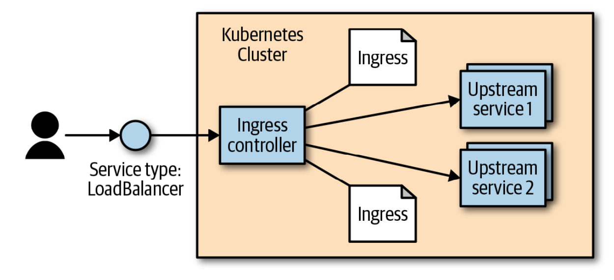

# Chapter 8: HTTP load balancing with Ingress

Notes: Service object operates at Layer 4 (according to the OSI model). This means that it only forwards TCP and UDP connections and doesn’t look inside of those connections. Because of this, hosting many applications on a cluster uses many different exposed services.

Kubernetes calls its HTTP-based load-balancing system `Ingress`. Ingress is a Kubernetes-native way to implement the “virtual hosting” pattern. One of the more complex aspects of the pattern is that the user has to manage the load balancer configuration file. In a dynamic environment and as the set of virtual hosts expands, this can be very complex. The Kubernetes Ingress system works to simplify this by:

- standardizing that configuration
- moving it to a standard Kubernetes object
- merging multiple Ingress objects into a single config for the load balancer

The typical software base implementation looks something like what is depicted in the below figure. The `Ingress controller` is a software system exposed outside the cluster using a service of type: `LoadBalancer`. It then proxies requests to “upstream” servers. The configuration for how it does this is the result of reading and monitoring `Ingress objects`.




## Ingress Spec VS Ingress Controllers

In Kubernetes, Ingress allows external access to services within the cluster. Unlike other components, it doesn’t come with a default controller. Instead, users must pick and install one from various options. This design is due to the absence of a one-size-fits-all load balancer and because Ingress was introduced before some extensibility features in Kubernetes. As Ingress evolves, it may integrate more with these features.

## Installing Contour

This is a controller built to configure the open source (and CNCF project) load balancer called `Envoy`. Envoy is built to be dynami‐ cally configured via an API. The Contour Ingress controller takes care of translating the Ingress objects into something that Envoy can understand.

You can find a getting started guide over [here](https://projectcontour.io/getting-started/)

## Configuring DNS

To make Ingress work well, you need to configure DNS entries to the external address for your load balancer. You can map multiple hostnames to a single external endpoint and the Ingress controller will play traffic cop and direct incoming requests to the appropriate upstream service based on that hostname.

For this chapter, we assume that you have a domain called `example.com`. You need to configure two DNS entries: `alpaca.example.com` and `bandicoot.example.com`. If you have an IP address for your external load balancer, you’ll want to create A records. If you have a hostname, you’ll want to configure CNAME records.

## Configuring a Local hosts file

If you don’t have a domain or if you are using a local solution such as minikube, you can set up a local configuration by editing your `/etc/hosts` file to add an IP address. You need `admin/root` privileges on your workstation. The location of the file may differ on your platform, and making it take effect may require extra steps.

Edit the file to add a line like the following:

```sh
<ip-address> alpaca.example.com bandicoot.example.com
```

For `<ip-address>`, fill in the external IP address for Contour. If all you have is a hostname (like from AWS), you can get an IP address (that may change in the future) by executing `host -t a <address>`.

## Using Ingress

### Simple ingress

```sh
apiVersion: extensions/v1beta1
kind: Ingress
metadata:
    name: simple-ingress
spec:
    backend:
        serviceName: alpaca
        servicePort: 8080
```

### Using hostnames

```sh
apiVersion: extensions/v1beta1
kind: Ingress
metadata:
    name: host-ingress
spec:
    rules:  
    - host: alpaca.example.com
        http: 
            paths:
            - backend:
                serviceName: alpaca
                servicePort: 8080
```

### Using paths

```sh
apiVersion: extensions/v1beta1
kind: Ingress
metadata:
    name: path-ingress
spec:
    rules:
    - host: bandicot.example.com
        http:
            paths:
            - path: "/"
                backend:
                    serviceName: bandicot
                    servicePort: 8080
            - path: "/a/"
                backend:
                    serviceName: alpaca
                    servicePort: 8080
```

How to apply use the Ingress services

```sh
# Apply the Ingress object
kubectl apply -f path-ingress.yaml

# Get the service
kubectl get ingress

# Get a more detailed description
kubectl describe ingress path-ingress

# Delete the service
kubectl delete ingress path-ingress
```

## Advanced Ingress Topics & Gotchas

The level of support for these features differs based on the Ingress controller implementation, and two controllers may implement a feature in slightly different ways. Many of the extended features are exposed via annotations on the Ingress object. Be careful, as these annotations can be hard to validate and are easy to get wrong.

### Running multiple Ingress Controllers

Oftentimes, you may want to run multiple Ingress controllers on a single cluster. In that case, you specify which Ingress object is meant for which Ingress controller using the `kubernetes.io/ingress.class` annotation.

### Multiple Ingress Objects

Caution: If you specify duplicate and conflicting configurations, the behavior is undefined. It is likely that different Ingress controllers will behave differently.

### Ingress & Namespaces

First, due to an abundance of security caution, an Ingress object can only refer to an upstream service in the same namespace. This means that you can’t use an Ingress object to point a subpath to a service in another namespace.

However, multiple Ingress objects in different namespaces can specify subpaths for the same host. These Ingress objects are then merged together to come up with the final config for the Ingress controller.

This cross-namespace behavior means that it is necessary that Ingress be coordinated globally across the cluster. If not coordinated carefully, an Ingress object in one namespace could cause problems (and undefined behavior) in other namespaces.

Typically there are no restrictions built into the Ingress controller around what name‐ spaces are allowed to specify what hostnames and paths. Advanced users may try to enforce a policy for this using a custom admission controller.

### Path Rewriting

Path rewriting isn’t a silver bullet, though, and can often lead to bugs. Many web applications assume that they can link within themselves using absolute paths. In that case, the app in question may be hosted on /subpath but have requests show up to it on /. It may then send a user to /app-path. There is then the question of whether that is an “internal” link for the app (in which case it should instead be /subpath/app- path) or a link to some other app. For this reason, it is probably best to avoid sub‐ paths if you can help it for any complicated applications.

### Serving TLS

First, users need to specify a secret with their TLS certificate and keys—something like what is outlined in Example 8-4. You can also create a secret imperatively with:

```sh
kubectl create secret tls <secret-name> --cert <certificate-pem-file> -- key <private-key-pem-file>
```

```sh
apiVersion: v1
kind: Secret
metadata:
    creationTimestamp: null
    name: tls-secret-name
type: kubernetes.io/tls
data:
    tls.crt: <base64 encoded certificate>
    tls.key: <base64 encoded private key>
```

Once you have the certificate uploaded, you can reference it in an Ingress object. This specifies a list of certificates along with the hostnames that those certificates should be used for. Again, if multiple Ingress objects specify certificates for the same hostname, the behavior is undefined.

```sh
apiVersion: extensions/v1beta1
kind: Ingress
metadata:
    name: tls-ingress
spec:
    tls:
    - hosts:
        - alpaca.example.com
    rules:  
    - host: alpaca.example.com
        http: 
            paths:
            - backend:
                serviceName: alpaca
                servicePort: 8080
```